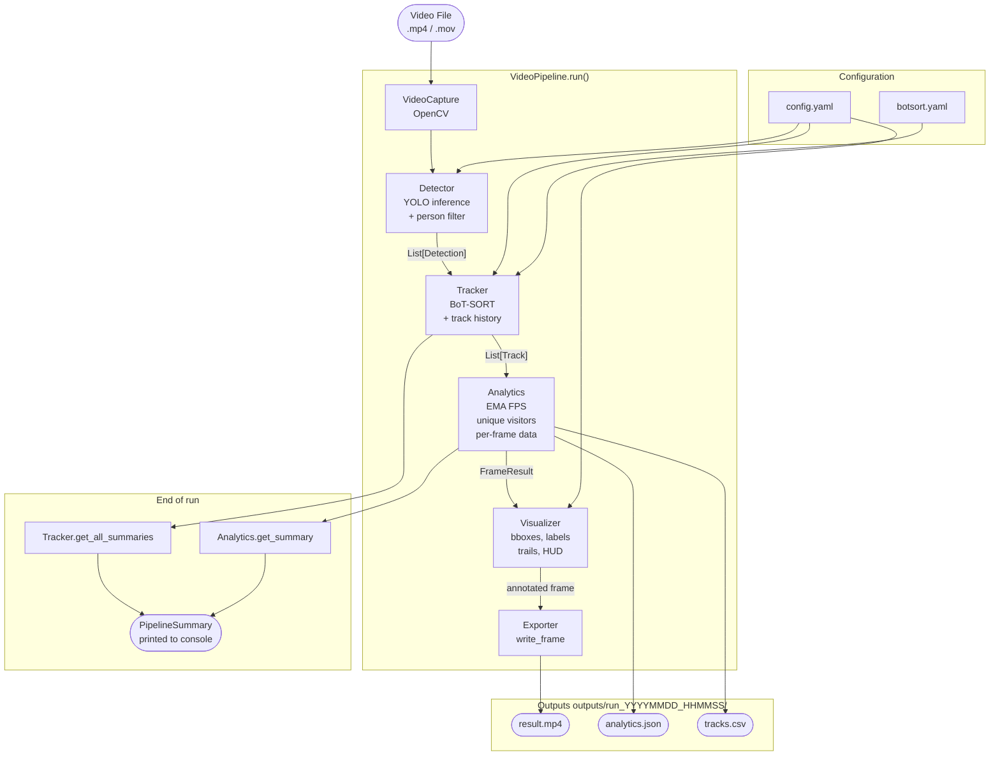

# VisionTrack

Real-Time Multi-Object Tracking & Crowd Analytics using YOLOv8+ and BoT-SORT.

VisionTrack detects and tracks every person in a video, assigns each one a
persistent unique ID, and produces an annotated output video alongside
structured analytics logs (JSON + CSV).

---

## Features

- **Person detection** via YOLOv8/v9/v10/v11 — 17 model variants from nano (fast) to x-large (accurate)
- **BoT-SORT tracking** — Kalman filter + ReID appearance embeddings for identity persistence across occlusions
- **Real-time overlays** — bounding boxes, track IDs, trajectory trails, unique visitor count, FPS
- **Unique visitor counter** — cumulative count of all unique persons seen throughout the video
- **Structured exports** — annotated MP4, per-frame JSON analytics, flat CSV track log
- **Config-driven** — all parameters in `config/config.yaml`, zero hardcoding
- **Hardware auto-detection** — CUDA → MPS (Apple Silicon) → CPU fallback
- **Multi-model evaluation** — benchmark multiple YOLO variants side-by-side with `evaluate.py`
- **MOT17 compatible** — works with standard benchmark datasets via the included conversion helper

---

## Architecture



See [docs/ARCHITECTURE.md](docs/ARCHITECTURE.md) for the full component
descriptions, data-flow details, and extension points.

---

## Installation

### Prerequisites

- Python 3.10 or higher
- macOS (Apple Silicon MPS), Linux (CUDA), or any OS (CPU)
- FFmpeg (optional, only needed for `.mov` → `.mp4` conversion)

### Quick Install

```bash
# 1. Clone the repository
git clone https://github.com/yourusername/visiontrack.git
cd visiontrack

# 2. Create a virtual environment
python3 -m venv .venv
source .venv/bin/activate          # Windows: .venv\Scripts\activate

# 3. Install dependencies
pip install -e .

# 4. Verify installation
visiontrack --version              # VisionTrack 1.0.0
visiontrack --help
```

### Install with dev dependencies

```bash
pip install -e ".[dev]"
```

### Verify GPU support

```bash
# CUDA
python3 -c "import torch; print(torch.cuda.is_available())"

# Apple Silicon MPS
python3 -c "import torch; print(torch.backends.mps.is_available())"
```

---

## Quick Start

Place a video in `sample_videos/` and run:

```bash
# Fastest — yolov8n on Apple Silicon
visiontrack --input sample_videos/crowd.mp4 --output results/ --device mps

# Balanced — yolov8m on GPU
visiontrack --input sample_videos/crowd.mp4 --model yolov8m --device cuda

# CPU fallback
visiontrack --input sample_videos/crowd.mp4 --model yolov8n --device cpu
```

On first run, YOLO weights (~6 MB for yolov8n) are downloaded automatically
to `models/`. Subsequent runs load from the local cache.

---

## CLI Usage

```
visiontrack --input VIDEO [options]
```

### Required

| Argument        | Description                          |
|-----------------|--------------------------------------|
| `--input, -i`   | Path to the input video file         |

### Output & Config

| Argument         | Default              | Description                                        |
|------------------|----------------------|----------------------------------------------------|
| `--output, -o`   | `outputs/`           | Root directory for outputs (timestamped sub-dir)   |
| `--config, -c`   | `config/config.yaml` | Path to the YAML configuration file               |

### Model Overrides

| Argument       | Default          | Description                                              |
|----------------|------------------|----------------------------------------------------------|
| `--model`      | from config      | YOLO variant: `yolov8n`, `yolov8s`, `yolov8m`, `yolov8l`, `yolov8x`, `yolo11n` … |
| `--confidence` | from config      | Detection confidence threshold [0.0–1.0]                 |
| `--device`     | from config      | Compute device: `cuda`, `mps`, `cpu`                     |
| `--skip-frames`| from config      | Skip N frames between processed frames (0 = all)         |

### Flags

| Argument       | Description                                    |
|----------------|------------------------------------------------|
| `--verbose, -v`| Enable DEBUG logging                           |
| `--version`    | Print version and exit                         |

### Examples

```bash
# Basic run
visiontrack --input metro.mp4 --output results/

# High-accuracy GPU run
visiontrack --input metro.mp4 --model yolov8m --device cuda --output results/

# Speed-optimised with frame skipping (2× faster, slight quality loss)
visiontrack --input metro.mp4 --model yolov8n --skip-frames 1

# Custom confidence threshold with verbose logging
visiontrack --input metro.mp4 --confidence 0.4 --verbose

# Direct Python execution (same as visiontrack command)
python main.py --input metro.mp4 --output results/ --model yolov8m
```

---

## Evaluation Script

Compare multiple models on the same video:

```bash
# Compare three model sizes
visiontrack-eval --video sample_videos/crowd.mp4 \
                 --models yolov8n yolov8s yolov8m \
                 --device mps

# Also save annotated output videos
visiontrack-eval --video sample_videos/crowd.mp4 \
                 --models yolov8n yolov8m \
                 --device mps --save-video
```

Output table:

```
+--------------+-----------+------------+-----------+----------+--------+------------+----------+
| Model        | Avg FPS   | Inf (ms)   | Time (s)  | Unique   | Peak   | Dwell (s)  | Status   |
+--------------+-----------+------------+-----------+----------+--------+------------+----------+
| yolov8n      | 14.90     | 66.20      | 24.28     | 34       | 7      | 2.06       | ok       |
| yolov8s      | 11.80     | 83.88      | 30.62     | 38       | 8      | 1.97       | ok       |
| yolov8m      | 9.77      | 101.42     | 36.96     | 44       | 8      | 1.69       | ok       |
+--------------+-----------+------------+-----------+----------+--------+------------+----------+
```

Results and system info are saved to `outputs/eval/evaluation_report.json`.

---

## Configuration

All pipeline parameters live in `config/config.yaml`.
CLI arguments override YAML values. Environment variables override both.

### Key sections

```yaml
model:
  type: "yolov8n"            # YOLO variant (see SUPPORTED_MODELS in constants.py)
  confidence_threshold: 0.25 # Min detection confidence [0.0, 1.0]
  iou_threshold: 0.45        # NMS IoU threshold [0.0, 1.0]
  warmup_frames: 3           # Dummy frames to prime GPU before measuring FPS

device:
  preferred: "cuda"          # cuda | mps | cpu
  fallback: "cpu"

tracker:
  config_file: "config/botsort.yaml"
  persist: true

video:
  output_codec: "mp4v"       # mp4v | XVID | avc1
  skip_frames: 0             # 0 = process every frame

visualization:
  show_boxes: true
  show_ids: true
  show_unique_count: true
  show_fps: true
  trail_length: 30           # trajectory trail history (0 = off)
  hud_alpha: 0.6             # overlay background opacity [0.0, 1.0]

export:
  save_video: true
  save_json: true
  save_csv: true
```

### BoT-SORT tracker config

`config/botsort.yaml` controls the tracker behaviour:

```yaml
track_buffer: 30        # frames to keep lost tracks alive (raise for long occlusions)
match_thresh: 0.8       # IoU threshold for track association
fuse_score: True        # fuse detection confidence with IoU
gmc_method: sparseOptFlow  # global motion compensation (use "none" for static cameras)
with_reid: False        # enable ReID (more accurate but slower)
```

### Environment variable overrides

```bash
VISIONTRACK_DEVICE=cpu        # override device.preferred
VISIONTRACK_MODEL=yolov8m     # override model.type
VISIONTRACK_CONFIDENCE=0.4    # override model.confidence_threshold
VISIONTRACK_LOG_LEVEL=DEBUG   # override logging.level
```

---

## Output

Each run creates a timestamped directory:

```
results/
└── run_20240115_143022/
    ├── result.mp4        ← annotated video with tracking overlays
    ├── analytics.json    ← full analytics log (see structure below)
    └── tracks.csv        ← flat per-detection CSV
```

### analytics.json structure

```json
{
  "metadata": {
    "generated_at": "2024-01-15T14:30:22+00:00",
    "input_video": "sample_videos/crowd.mp4",
    "config": { "model": { "type": "yolov8m" }, "..." }
  },
  "summary": {
    "total_frames": 361,
    "unique_visitors": 44,
    "peak_concurrent_tracks": 8,
    "avg_fps": 9.77,
    "avg_inference_time_ms": 101.42,
    "avg_dwell_time": 1.69
  },
  "tracks": [
    {
      "track_id": 1,
      "first_seen_frame": 0,
      "last_seen_frame": 120,
      "dwell_time": 5.0,
      "total_appearances": 121,
      "trajectory": [{ "x1": 10, "y1": 20, "x2": 110, "y2": 220 }, "..."]
    }
  ],
  "analytics": { "frames": [ "..." ] }
}
```

### tracks.csv columns

```
frame_id, timestamp, track_id, x1, y1, x2, y2, confidence, fps
```

---

## Performance

### Benchmarks on Apple M-series (MPS)

| Model   | Avg FPS | Inf (ms) | Unique Visitors | Use Case                      |
|---------|---------|----------|-----------------|-------------------------------|
| yolov8n | ~15     | ~66 ms   | Good            | Real-time, CPU/entry GPU      |
| yolov8s | ~12     | ~84 ms   | Better          | Balanced, Apple Silicon       |
| yolov8m | ~10     | ~101 ms  | Best            | Accuracy-focused, GPU         |
| yolov8l | ~7      | ~140 ms  | Best+           | High accuracy, dedicated GPU  |

### On NVIDIA GPU (approximate)

| Model   | Avg FPS   | Inf (ms) |
|---------|-----------|----------|
| yolov8n | ~80       | ~12 ms   |
| yolov8m | ~45       | ~22 ms   |
| yolov8x | ~25       | ~40 ms   |

### Tips for better performance

```bash
# Skip every other frame (2× speed, minor quality loss)
visiontrack --input video.mp4 --skip-frames 1

# Lower confidence to reduce false positives on clean footage
visiontrack --input video.mp4 --confidence 0.35

# Disable ReID for faster BoT-SORT (set in config/botsort.yaml)
# with_reid: False
```

---

## Project Structure

```
VisionTrack/
├── config/
│   ├── config.yaml          # All pipeline parameters
│   └── botsort.yaml         # BoT-SORT tracker parameters
├── src/
│   ├── pipeline.py          # Main orchestrator (VideoPipeline)
│   ├── detector.py          # YOLO wrapper + person filtering
│   ├── tracker.py           # BoT-SORT wrapper + track history
│   ├── analytics.py         # EMA FPS, unique visitors, metrics
│   ├── visualizer.py        # Frame annotation (boxes, trails, HUD)
│   ├── exporter.py          # Video + JSON + CSV output
│   ├── config_manager.py    # YAML loading, validation, overrides
│   ├── device_manager.py    # CUDA/MPS/CPU auto-detection
│   ├── decorators.py        # @measure_time, @retry
│   ├── data_models.py       # Typed dataclasses (Detection, Track, …)
│   ├── constants.py         # Palette, fonts, supported models
│   └── cli.py               # visiontrack entry point
├── exceptions/
│   └── __init__.py          # Typed exception hierarchy
├── loggers/
│   └── __init__.py          # Colour console + file logging
├── tests/                   # 362 unit tests
├── docs/
│   ├── ARCHITECTURE.md      # Pipeline diagram + component details
│   └── DESIGN.md            # Design decisions + trade-offs
├── scripts/
│   └── download_mot.py      # MOT17 sequence → MP4 converter
├── models/                  # YOLO weights (auto-downloaded, gitignored)
├── outputs/                 # Pipeline run outputs (gitignored)
├── sample_videos/           # Test videos (gitignored)
├── main.py                  # Entry point (python main.py …)
├── evaluate.py              # Multi-model benchmark script
├── pyproject.toml           # Package metadata + tool config
└── requirements.txt         # Pip fallback
```

---

## Development Setup

```bash
# Install with dev dependencies
pip install -e ".[dev]"

# Run all tests
pytest

# Run specific test file
pytest tests/test_analytics.py -v

# Code formatting
black src/ tests/

# Linting
ruff check src/ tests/

# Type checking
mypy src/
```

### Running tests

The test suite (362 tests) runs in under 1 second with no GPU, no internet
connection, and no model weights — all external dependencies are mocked.

```bash
pytest tests/ -v
# === 362 passed in 0.6s ===
```

---

## Troubleshooting

### `No module named 'ultralytics'`
The pipeline must run inside the virtual environment:
```bash
source .venv/bin/activate
visiontrack --input video.mp4 …
```

### `VideoIOError: file not found`
Check the path is correct and the file exists:
```bash
ls sample_videos/
visiontrack --input sample_videos/crowd.mp4 …
```

### `.mov` files not opening
Most iPhone `.mov` files (H.264) open directly. For ProRes or HEVC:
```bash
ffmpeg -i input.mov -c:v libx264 -preset fast output.mp4
visiontrack --input output.mp4 …
```

### `confidence must be in [0, 1], got 2.0`
This is a known BoT-SORT fuse_score issue — already patched in
`Tracker._parse_results()`. If you see it, ensure you are on the latest
version of the repo.

### Weights downloading to project root instead of `models/`
Fixed in the current version. If you have stray `.pt` files in the root:
```bash
mv *.pt models/
```

### Low FPS on CPU
```bash
# Use smallest model + frame skipping
visiontrack --input video.mp4 --model yolov8n --skip-frames 1 --device cpu
```

### CUDA out of memory
```bash
# Use a smaller model or fall back to CPU
visiontrack --input video.mp4 --model yolov8n --device cpu
```

---

## Future Work

See [docs/DESIGN.md](docs/DESIGN.md) for the full roadmap. Key upcoming
enhancements:

- **RTSP / webcam support** — live stream tracking
- **Zone-based counting** — count entries/exits per defined polygon region
- **Streamlit dashboard** — web UI with live preview and interactive charts
- **Heatmap generation** — crowd density visualisation across the full video
- **Multi-camera tracking** — shared identity space across camera views
- **Alert system** — notifications on density thresholds or dwell time limits
- **Edge deployment** — ONNX/TensorRT export for Jetson devices

---

## License

MIT License. See `LICENSE` for details.
