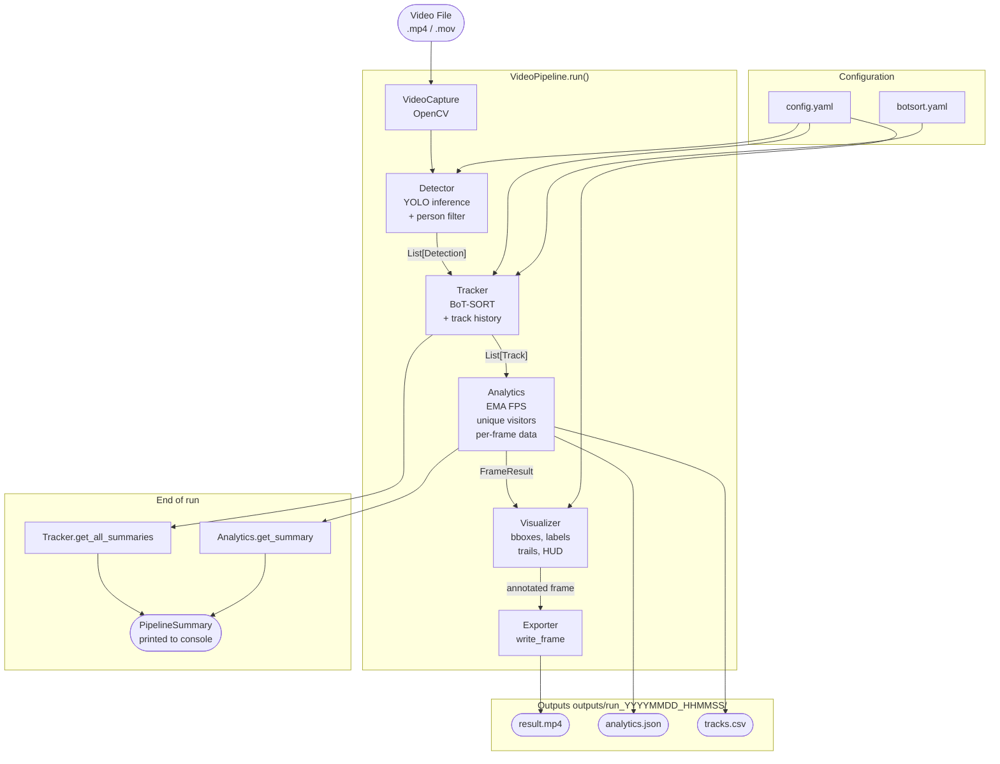

# VisionTrack — Architecture

This document describes the pipeline architecture, component responsibilities,
data flow, and extension points.

---

## Pipeline Diagram



---

## Component Responsibilities

### ConfigManager (`src/config_manager.py`)

- Loads and validates `config/config.yaml` at startup.
- Exposes all settings as nested dot-access attributes (`cfg.model.type`).
- Merges CLI argument overrides and environment variable overrides.
- Provides helper methods: `get_model_path()`, `get_output_dir()`.

### DeviceManager (`src/device_manager.py`)

- Auto-detects the best available compute device: CUDA → MPS → CPU.
- Accepts a `preferred` device from config or CLI with graceful fallback.
- Returns a device string (`"mps"`, `"cuda:0"`, `"cpu"`) used by YOLO.

### Detector (`src/detector.py`)

- Loads a YOLO model from `models/<name>.pt` (auto-downloads on first run).
- Runs inference on a single BGR frame.
- Filters results to COCO class 0 (person) and applies the confidence threshold.
- Clamps confidence values to `[0.0, 1.0]` (BoT-SORT fuse_score can exceed 1.0).
- Returns `List[Detection]` — each with a `BoundingBox` and confidence score.

### Tracker (`src/tracker.py`)

- Wraps `model.track(frame, tracker="config/botsort.yaml", persist=True)`.
- Converts raw Ultralytics results into `List[Track]` with stable integer IDs.
- Maintains per-track history: `Dict[track_id, List[Track]]`.
- Records `first_seen` and `last_seen` timestamps for dwell time calculation.
- Provides `get_track_summary(id)` and `get_all_summaries()` for export.

### Analytics (`src/analytics.py`)

- Accumulates metrics across all processed frames.
- **Unique visitor counter**: `Set[track_id]` — never double-counts.
- **EMA FPS**: exponential moving average of wall-clock inter-frame intervals.
- **Peak concurrent tracks**: maximum simultaneous active tracks.
- `update()` is called once per frame and returns a `FrameResult`.
- `get_summary()` returns a JSON-serialisable dict for the Exporter.

### Visualizer (`src/visualizer.py`)

- Annotates a copy of the input frame (never modifies the original).
- Draws bounding boxes with deterministic per-ID colours from `COLOR_PALETTE`.
- Draws track ID labels with solid background rectangles for legibility.
- Renders trajectory trails using per-track `deque` of centre points.
- Renders two HUD panels via `cv2.addWeighted` alpha blending:
  - Top-left: `"Unique Visitors: N"`
  - Top-right: `"FPS: X.X | Yms"`
- All overlays independently togglable via config flags.

### Exporter (`src/exporter.py`)

Three-phase lifecycle matching the pipeline loop:

```
prepare(output_dir, fps, w, h)  → opens VideoWriter, creates output dir
write_frame(annotated)          → called once per processed frame
finalise(summary, ...)          → flushes video, writes JSON + CSV
```

**JSON** (`analytics.json`):
```
metadata → provenance (date, input video, config snapshot)
summary  → aggregate statistics
tracks   → per-track dwell time and trajectory
analytics → per-frame detection data
```

**CSV** (`tracks.csv`):
```
frame_id, timestamp, track_id, x1, y1, x2, y2, confidence, fps
```

### VideoPipeline (`src/pipeline.py`)

- The only orchestrator — wires all components together.
- Receives every component via constructor (dependency injection).
- Processing loop per frame:
  ```
  read → detect → track → analytics.update → visualizer.annotate → exporter.write_frame
  ```
- tqdm progress bar shows: `frame/total | FPS | inf_ms | unique`.
- Handles SIGINT gracefully: saves partial results on Ctrl+C.
- `_build_summary()` computes aggregate statistics from `FrameResult` list.

### CLI (`src/cli.py`)

- `build_parser()` — argparse with all supported flags.
- `validate_args()` — checks file existence, value ranges before touching pipeline.
- `build_pipeline()` — wires all components in dependency order.
- `main()` — entry point; exit codes: 0 = success, 1 = runtime error, 2 = bad args.

---

## Data Models (`src/data_models.py`)

```
BoundingBox          x1, y1, x2, y2  +  width/height/area/center helpers
    │
    ├── Detection    bbox, confidence, class_id
    │
    └── Track        track_id, bbox, confidence, class_id, frame_id, timestamp

FrameResult          frame_id, timestamp, tracks, detection_count, inference_ms, fps

TrackSummary         track_id, first/last_seen frame+time, total_appearances,
                     trajectory: List[BoundingBox]  →  dwell_time property

PipelineSummary      aggregate stats + output file paths  →  __str__ for console
```

All are `@dataclass` with `__post_init__` validation. Typed constructors
(`from_raw(...)`) avoid raw tuple passing throughout the codebase.

---

## Exception Hierarchy (`exceptions/__init__.py`)

```
VisionTrackException  (base — message + user_message + details)
    ├── ConfigurationError    bad YAML field or value
    ├── ModelLoadError        YOLO weights not found or corrupt
    ├── VideoIOError          file not found or OpenCV can't open it
    ├── DetectionError        model inference exception
    ├── TrackingError         BoT-SORT exception
    ├── DeviceError           no suitable compute device
    ├── ExportError           VideoWriter or file I/O failure
    └── AnalyticsError        unexpected analytics state
```

`user_message` is safe to surface in CLI output.
`message` is the detailed technical description for logs.

---

## Logging (`loggers/__init__.py`)

```
get_logger(__name__)  →  "visiontrack.<module>" namespace
```

- Colour-coded console output (green INFO, yellow WARNING, red ERROR).
- Simultaneous file output to `logs/YYYY_MM_DD_HH_MM_SS.log`.
- Third-party libraries (ultralytics, torch, urllib3, PIL) suppressed to WARNING.
- Level controlled by `VISIONTRACK_LOG_LEVEL` env var or `config.yaml`.

---

## Configuration Flow

```
config/config.yaml
        │
        ▼
   ConfigManager
   (load + validate)
        │
        ├── env vars override  (VISIONTRACK_DEVICE, VISIONTRACK_MODEL …)
        │
        └── CLI args override  (--model, --device, --confidence …)
                │
                ▼
        all components receive
        the same cfg object
```

---

## Extension Points

### Adding a new input source (RTSP / webcam)

`VideoPipeline._open_video()` currently wraps `cv2.VideoCapture(path)`.
To support RTSP or webcam, pass an RTSP URL or device index:

```python
# RTSP
cap = cv2.VideoCapture("rtsp://camera.local/stream1")

# Webcam
cap = cv2.VideoCapture(0)
```

Add a `--rtsp` or `--webcam` flag to `cli.py`, and route to the
appropriate VideoCapture source inside `_open_video()`.

### Adding a new YOLO model

Add the model name string to `SUPPORTED_MODELS` in `src/constants.py`:

```python
SUPPORTED_MODELS = [
    "yolov8n", ...,
    "yolo12n",   # new entry
]
```

No other changes required — `Detector._load_model()` passes the name
directly to `ultralytics.YOLO()`.

### Adding zone-based counting

1. Add a `zones` section to `config.yaml` with polygon coordinates.
2. Create `src/zone_counter.py` that checks each `Track.bbox` against
   polygons using `cv2.pointPolygonTest`.
3. Inject `ZoneCounter` into `VideoPipeline` alongside Analytics.
4. Visualizer can draw zone polygons with `cv2.polylines`.

### Adding a web dashboard (Streamlit)

```python
# app/streamlit_app.py
import streamlit as st
from src.cli import build_pipeline
# Upload video → run pipeline → display results
```

The pipeline's clean DI constructor means Streamlit can replace the CLI
without touching any component code.

### Swapping the tracker

Replace `config/botsort.yaml` with `bytetrack.yaml` (included in Ultralytics):

```yaml
# config/config.yaml
tracker:
  config_file: "config/bytetrack.yaml"
```

ByteTrack is faster but has more ID switches on re-entry after occlusion.

---

## Test Coverage

```
tests/
├── test_config.py      98 tests  — ConfigManager, _Namespace, validation
├── test_detector.py    43 tests  — detection, filtering, warmup, model loading
├── test_tracker.py     46 tests  — parsing, history, summaries, reset
├── test_analytics.py   57 tests  — EMA FPS, unique visitors, get_summary
├── test_visualizer.py  36 tests  — overlays, colours, trails, HUD
├── test_exporter.py    44 tests  — prepare/write/finalise, JSON/CSV
└── test_pipeline.py    38 tests  — orchestration, skip_frames, interrupt

Total: 362 tests  |  Runtime: ~0.6s  |  No GPU / no model weights required
```

All external dependencies (Ultralytics, OpenCV VideoCapture, filesystem)
are mocked so the suite runs identically on any machine.
